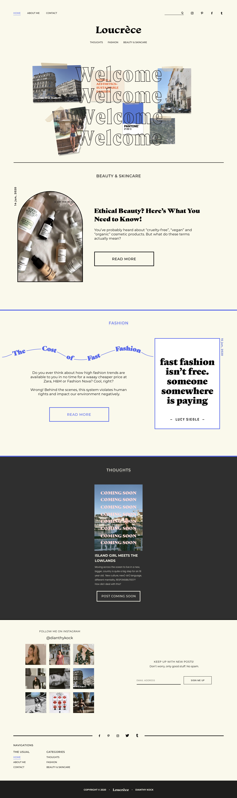
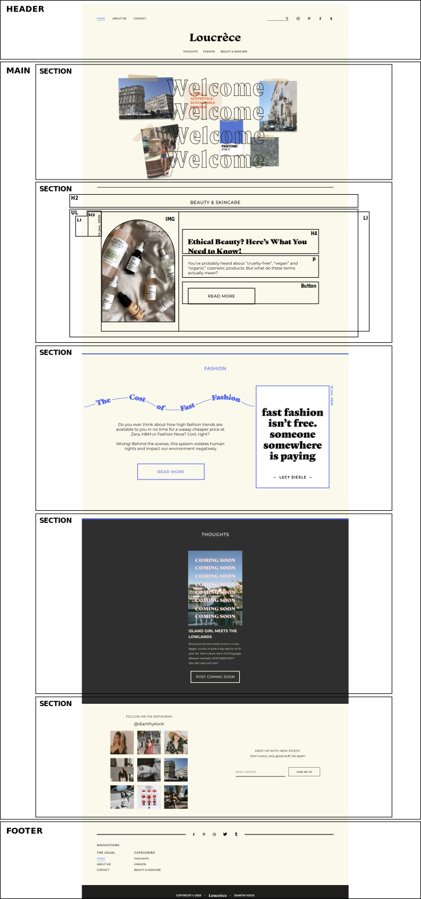

# Procesverslag
**Auteur:** Dianthy Kock

Markdown cheat cheet: [Hulp bij het schrijven van Markdown](https://github.com/adam-p/markdown-here/wiki/Markdown-Cheatsheet). Nb. de standaardstructuur en de spartaanse opmaak zijn helemaal prima. Het gaat om de inhoud van je procesverslag. Besteedt de tijd voor pracht en praal aan je website.

## Bronnenlijst
1. -bron 1-
2. -bron 2-
3. -...-

## Eindgesprek (week 7/8)

-dit ging goed & dit was lastig-

**Screenshot(s):**

-screenshot(s) van je eindresultaat-

## Voortgang 3 (week 6)

-same as voortgang 1-

## Voortgang 2 (week 5)

-same as voortgang 1-

## Voortgang 1 (week 3)

### Stand van zaken

Dit ging goed: Vormgeving met HTML en CSS ging goed, maar ik ben onzeker of het goed/semantisch is.
Dit ging lastig: 
- flexbox gebruiken voor responsiveness van articles.
- correct gebruik van css voor positioneren en vormgeven
- h1 grootte aanpassen bij mobiel en desktop

**Screenshot(s):**

(images/voortgang1-screenshot.png)

### Agenda voor meeting

- dingen naast elkaar zetten. Op mobiel bijvoorbeeld 2 en dekstop 4
- Hoe kun je makkelijker zien nth gebeuren
- Mag je classes  gebruiken
- Mag je classes  gebruiken
- Moet je hamburger laten werken? 
- Hoe zet je het om in een hamburgermenu
- flexbox vragen, naast elkaar zetten bijvoorbeeld.

### Verslag van meeting

-na afloop snel uitkomsten vastleggen-

## Intake (week 1)

**Je startniveau:** Rode piste

**Je focus:** surface plane

**Je opdracht:** https://xd.adobe.com/view/ace71af0-cb96-4f12-5f9f-81778808d3b0-dad6/?fullscreen&hints=off

**Screenshot(s):**

**Breakdown-schets(en):**

